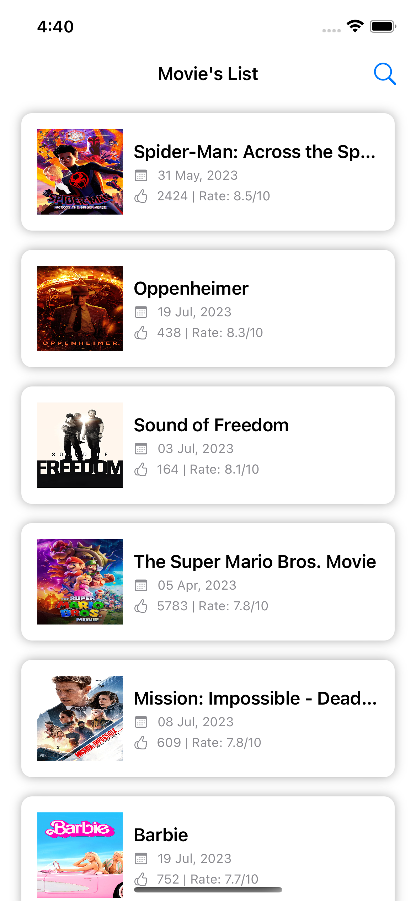
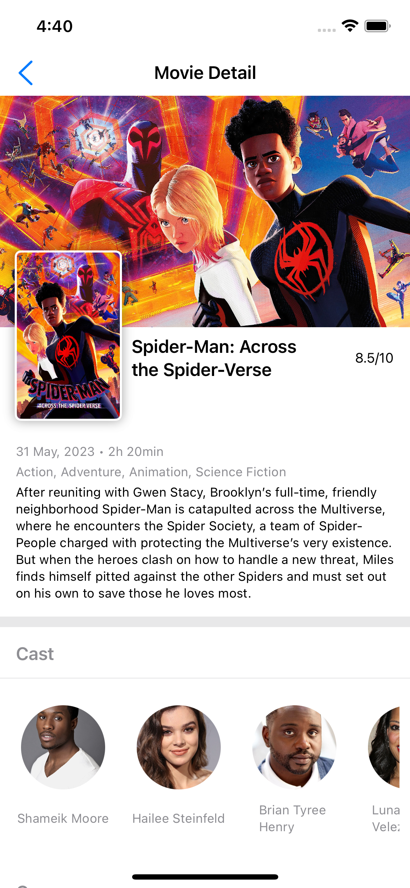
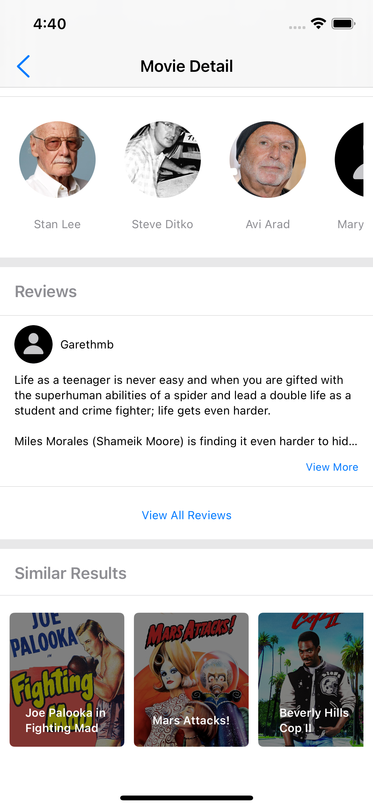
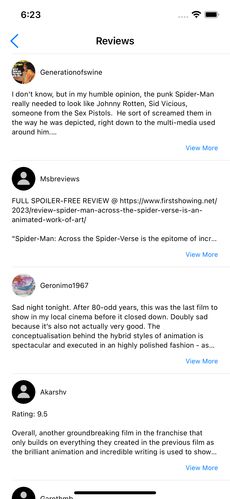
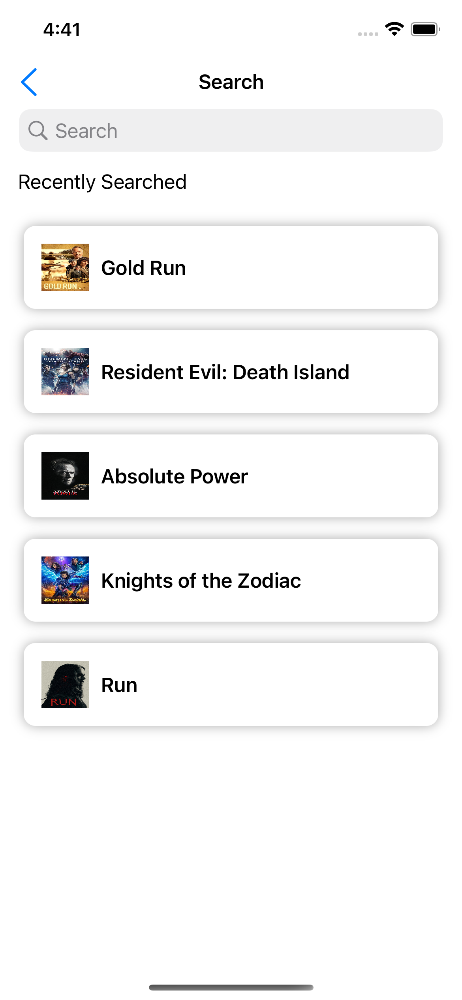

# MovieDBSwiftUI

MovieDBSwiftUI is a Swift-based iOS application that provides a user-friendly interface to search and browse movie details. The app is built using SwiftUI in the MVVM (Model-View-ViewModel) pattern and leverages the Combine framework for handling asynchronous data streams. CoreData is used for storing search results, and the SDWebImageSwiftUI library is integrated via a package manager for efficient image loading.

## Features

- Browse Movie list with pagination for smooth loading
- Browse movie details including title, overview, release date, and ratings
- View movie posters and images with smooth loading using SDWebImageSwiftUI
- Search for movies by title
- Persistent storage of recent search results using CoreData

## ScreenShots

| Home Screen                | Movie Details                | Movie Details              | Movie Reviews                | Movie Search                 |
| :------------------------: | :--------------------------: | :------------------------: | :--------------------------: | :--------------------------: |
|  |  |  |  |   |


## SwiftUI

SwiftUI helps you to build great-looking apps across all Apple platforms with the power of Swift — and as little code as possible. With SwiftUI, you can bring even better experiences to all users, on any Apple device, using just one set of tools and APIs.

## Architecture

The project is structured using the MVVM pattern, which separates the app into three main components:

- **Model:** Represents the data and business logic of the app. It interacts with the API, stores search results, and provides data to the ViewModel.

- **View:** Represents the UI components and their layout. It displays data and interacts with the user.

- **ViewModel:** Acts as a mediator between the Model and the View. It contains the presentation logic and data processing. It also provides data bindings to the View for reactive updates.

## API Calls and Combine

The Combine framework provides a declarative Swift API for processing values over time. These values can represent many kinds of asynchronous events. Combine declares publishers to expose values that can change over time, and subscribers to receive those values from the publishers.

The app uses the Combine framework to handle API calls. The `NetworkManager` class encapsulates API requests and responses using Combine's `URLSession` publisher. The ViewModel subscribes to these publishers to receive data asynchronously, and updates the View accordingly.

## CoreData for Search Results

Search results are stored using CoreData to provide offline access to the previous search queries. The `CoreDataManager` class handles CoreData operations, such as saving and fetching search results.

## Requirements

- Xcode 13 or later
- iOS 14 or later

## Installation

1. Clone the repository to your local machine.

```bash
git clone https://github.com/rprahulpatni/SwiftUIMovieDB.git
```

2. Open the `MovieDBSwiftUI` Xcode project.

3. Build and run the app on a simulator or a physical device.

## Dependencies

The following package is used in the project:

- [SDWebImageSwiftUI](https://github.com/SDWebImage/SDWebImageSwiftUI): For efficient and asynchronous image loading and caching in SwiftUI views.

To install the SDWebImageSwiftUI dependency, you can use the Swift Package Manager:

1. In Xcode, go to `File > Swift Packages > Add Package Dependency...`

2. Enter the following repository URL:

```
https://github.com/SDWebImage/SDWebImageSwiftUI.git
```

3. Click `Next` and choose the version you want to install. Click `Next` again.

4. Select the target(s) where you want to add the package and click `Finish`.

## Folder Structure

The project follows a structured folder organization to keep the code organized and maintainable. The folder structure is as follows:

```
MovieDBSwiftUI/
|-- Info.plist
|-- AppEntry/
|   |-- MovieDBSwiftUIApp
|-- View/
|   |   |-- Cells/
|   |   |-- SplashView
|   |   |-- MovieList
|   |   |-- MovieDetails
|   |   |-- MovieSearch
|-- ViewModel/
|   |-- MovieListViewModel
|   |-- MovieDetailsViewModel
|   |-- MovieSearchSearchViewModel
|-- Model/
|   |-- MovieListModel
|   |-- MovieDetailsModel
|-- Services/
|   |-- NetworkURL/
|   |-- URLEndpoints/
|   |-- APIDataProvider/
|   |-- NetworkManager/
|-- Data/
|   |-- MovieDBSwiftUI.xcdatamodeld
|   |-- Persistence
|-- Utils/
|   |-- CustomViews/
|   |-- Helper
|-- Resources/
|   |-- Assets.xcassets
|-- Preview Content/
```

## Description

- **Info.plist:** Contains details about the custom Launch screen.

- **AppEntry:** Contains SwiftUI views for the main app entry points.
  
- **View:** It includes `SplashView`, `MovieList`, `MovieDetails`, and `MovieSearch` views.

- **ViewModel:** Contains view models for handling business logic and data operations. It includes `MovieListViewModel`, `MovieDetailsViewModel`, and `MovieSearchViewModel`.

- **Model:** Contains data models used in the app. It includes `MovieListModel` and `MovieDetailsModel` to represent movie details.

- **Services:** Contains network services for making API calls. It includes `NetworkManager` for fetching movie data from the server.

- **Data:** Contains CoreData related files. It includes `CoreDataManager` for managing CoreData operations.

- **Utils:** Contains utility files and extensions used in the app.

- **Resources:** Contains project assets, such as images and other resources.

## Credits

The app uses data from The Movie Database (TMDb) API. For more information, please visit [https://www.themoviedb.org/documentation/api](https://www.themoviedb.org/documentation/api).

The project also uses the SDWebImageSwiftUI library, which is developed and maintained by the SDWebImage team. For more information, please visit [https://github.com/SDWebImage/SDWebImageSwiftUI](https://github.com/SDWebImage/SDWebImageSwiftUI).
